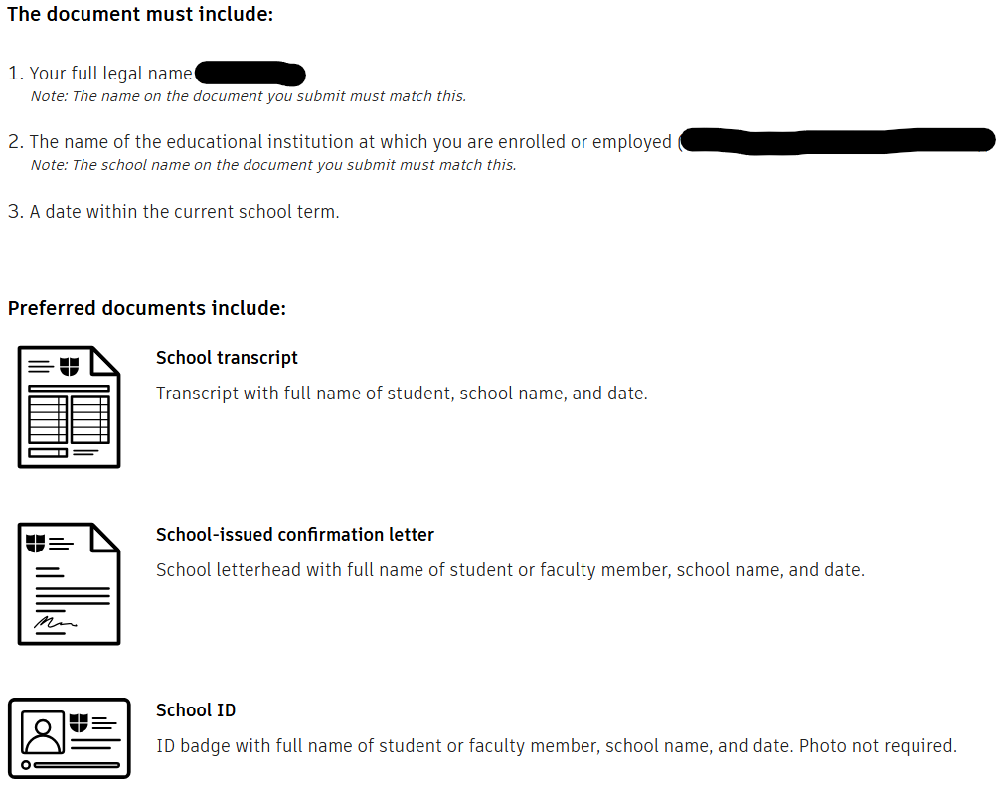

# Modeling Software


Use a personal email for basic account creation for both Fusion360 and Onshape, as using your school email prevents you from receiving the verification email to finish account setup.


## [**Fusion360**](https://www.autodesk.com/education/home)

Autodesk Fusion360 is a desktop program that has powerful and rich features that work perfectly for FTC. Although organically gaining access to Fusion360 would be to subscribe to a $57/month plan, you can use your high school or college information for the free education license.


Both Alhambra Senior High and Diablo Valley College are eligible for the education license. Sometimes, Autodesk may require additional information verifying your affiliation, as shown below.


<figure><figcaption></figcaption></figure>

## [**Onshape**](https://www.onshape.com/en/)

Onshape is a browser-based program that is designed for lower end machines, but still has rich features for FTC. There is a wide array of support within the FTC community with libraries of parts and generators available for free. Gaining access is easy, as it is free for education and can even be linked to a google account for easy login.
