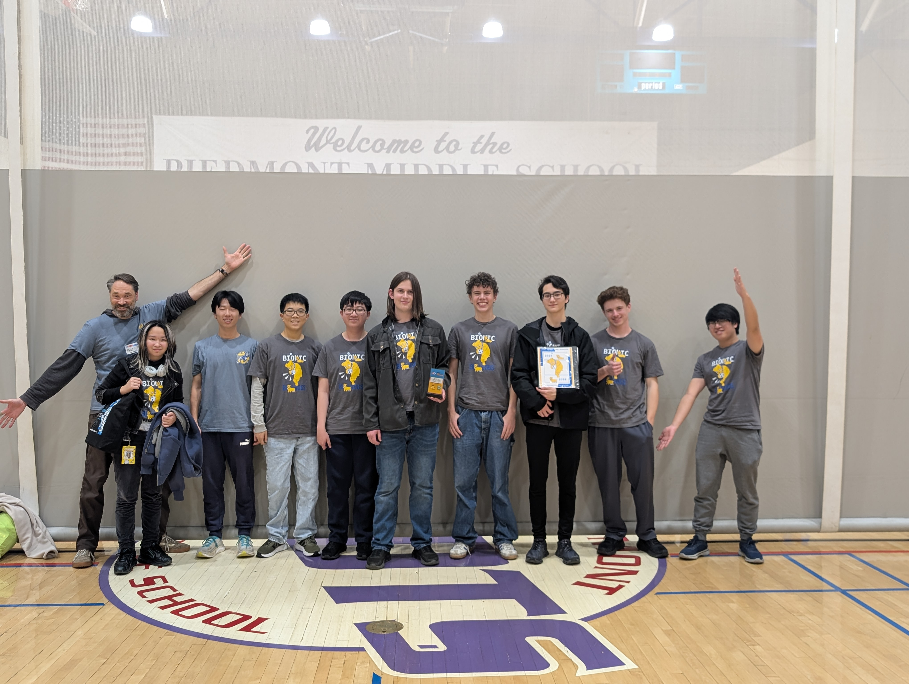

# Alhambra Robotics Docs

***

<h4 align="center"><strong>2025-26 Robotics Team</strong></h4>

<figure><figcaption></figcaption></figure>

## Jump into the sections

There are many different skills you can build in your time with FTC's robotics, yet one shouldn't be restricted to a specific set of skills. The sections below provide setup instructions, resources, some tips/tricks that were gained throughout the many seasons the club has existed.

<table data-card-size="large" data-view="cards"><thead><tr><th></th><th></th><th></th><th data-hidden data-card-target data-type="content-ref"></th><th data-hidden data-card-cover data-type="image">Cover image</th></tr></thead><tbody><tr><td><h4><i class="fa-rocket-launch" style="color:$primary;">:rocket-launch:</i></h4></td><td><h4>Getting started</h4></td><td>idk yet</td><td><a href="/broken/pages/PbYb0GukRhiS4qCHdRal">Broken link</a></td><td></td></tr><tr><td><h4><i class="fa-sunglasses" style="color:$primary;">:sunglasses:</i></h4></td><td><h4>Software</h4></td><td>Understand the mystifying arts of ✨<mark style="color:yellow;">code</mark>✨ and ❌<mark style="color:$danger;">debugging</mark>❌</td><td><a href="/broken/pages/EFXeLTHVDQLFgK0Iy51O">Broken link</a></td><td><a href=".gitbook/assets/image_2026-05-20_202517826.png">image_2026-05-20_202517826.png</a></td></tr><tr><td><h4><i class="fa-truck-moving" style="color:$primary;">:truck-moving:</i></h4></td><td><h4>Hardware</h4></td><td>Where physics, dedication, and a lack of parts combine</td><td><a href="/broken/pages/oUUNprjFZmH3rqDBvb9h">Broken link</a></td><td><a href=".gitbook/assets/Robot Prototype.png">Robot Prototype.png</a></td></tr><tr><td><h4><i class="fa-oil-temperature" style="color:$primary;">:oil-temperature:</i></h4></td><td><h4>3D Modeling</h4></td><td>Imagination transformed to a 3D render of downloadable RAM </td><td><a href="/broken/pages/vI5ZWHOh18UiniPig39t">Broken link</a></td><td><a href=".gitbook/assets/Screenshot 2025-11-14 202635.png">Screenshot 2025-11-14 202635.png</a></td></tr><tr><td><i class="fa-dollar-sign">:dollar-sign:</i></td><td><h4><strong>Outreach/Finance</strong></h4></td><td>What's not to love</td><td><a href="/broken/pages/DDYcSwlZgxOl6yOD7nRv">Broken link</a></td><td data-object-fit="fill"><a href=".gitbook/assets/image_2026-05-20_203840084.png">image_2026-05-20_203840084.png</a></td></tr></tbody></table>
